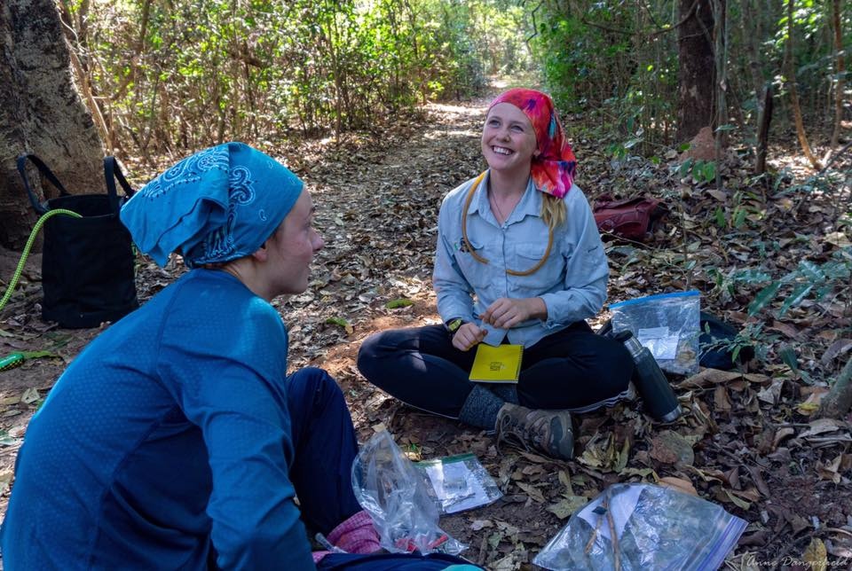

<!-- This adds my headshot, floating to the left of the text and with 20 pixels of padding around it.  -->

<!--  -->

I am a second year PhD student in the [Moreau Lab](https://www.moreaulab.entomology.cornell.edu/) at Cornell University. I am interested broadly in trait diversity in ants!

I aim to use a combination of morphology, ecology, life history, and behavior in order to explore questions that revolve around the evolution of diversity across ant lineages. I am also interested in making science more accessible to all and participate in various outreach activities. I also enjoy working with insect collections in both my research and outreach activities. 

In my free time, I enjoy spending time outdoors walking my dog, cross country skiing, hiking, and running. 

