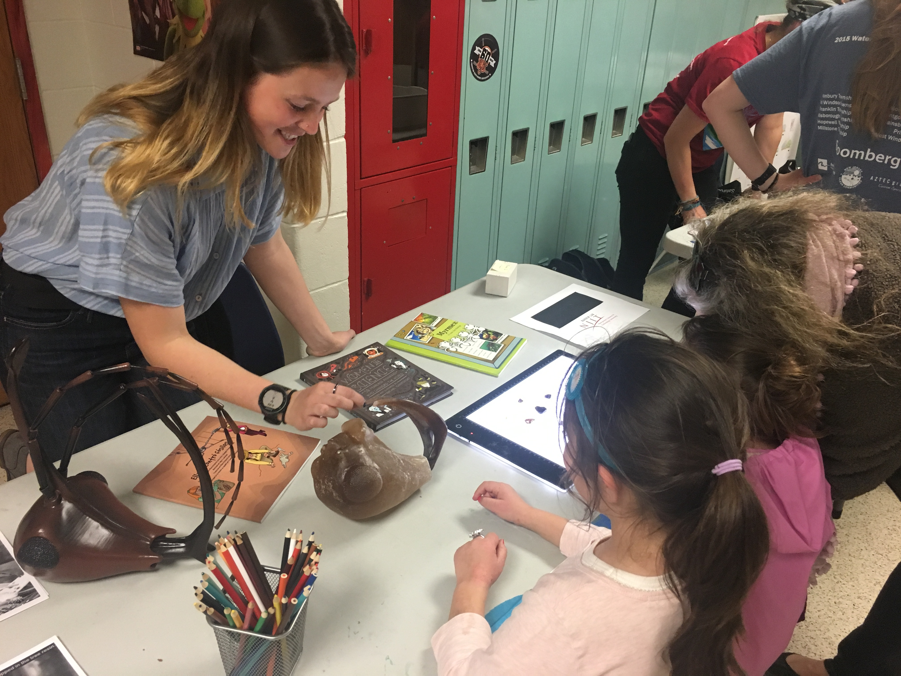

I am passionate about scientific outreach and believe that participation in outreach activities creates many opportunities to grow as a scientist. 

During the first two years of my time at Cornell University I have been a [GRASSHOPR](https://sites.google.com/view/grasshopratcornell/home) fellow as a part of the graduate student outreach program at Cornell. As a fellow, I have developed a four lesson course for the GRASSHOPR program aimed at teaching elementary aged students the basic principles of Entomological research. I was able to teach the course remotely over Zoom as well as in person. The general outline of my insect course is available at [this site](). Please do not hesitate to reach out if you want more information about GRASSHOPR, my course, or want to collaborate with me on teaching!

I also co-chair the Outreach Committee for the Graduate Student Club for Entomology "Jagatae". I have been involved in the planning and implementation of creating a “hands-on” teaching collection for outreach purposes as well as a workshop for the [Expanding your Horizons (EYH)](https://www.eyh.cornell.edu/) conference at Cornell. 

Insect coloring pages that I created are available for free [here](). 

