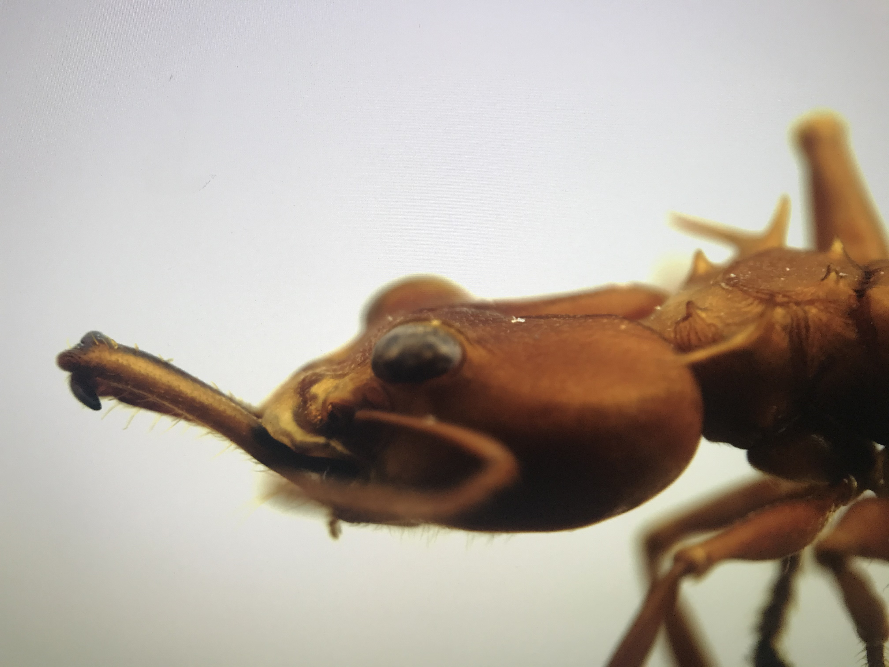

Why are there so many different ants?

Ants only compose one family, yet they are omnipresent and extraordinarily impactful in terrestrial ecosystems across the globe. Not only are these insects easy to identify, they present a unique system to ask some of the most interesting questions in biology due to their eusociality.

Ultimately, I am interested in what drives the diversity (morphological, behavioral, and ecology) we see across ant lineages. I am especially interested in questions that encapsulate investigating morphological trade-offs, interspecific interactions, and behavioral variation. I hope to use phylogenetics to parse apart complex systems by examining how individual traits coalesce and differentiate over time. 

Previously, I have investigated the diversity of ant eyes with respect to their ecology as well as investment in other sensory organs. By developing several two- and three-dimensional measurements to quantify eye investment and using phylogenetic comparative methods to account for evolutionary relationships among species. I found that ant eye diversity may be more strongly linked to developmental trade-offs with antennal investment rather than ecology. I worked on this project starting my sophomore year of my undergraduate studies at NJIT as a member of the [Barden Lab](https://bardenlab.org/) and published my work in September of 2021. [Click here](https://academic.oup.com/isd/article/5/5/9/6365886?login=true) to read more. 

I am currently interested in the diversity of aggressive behavior across ant lineages. Aggression is integral to ant biology in the lens of species interactions, collective defense, predation, and competition. Through a literature search paired with phylogenetic comparative methods, I aim to identify key traits that are associated with aggression in ants and investigate trends across the phylogeny. Evaluating which traits are correlated with aggressive tendencies may help explain some of the variation we see across the phylogeny.

Additionally, I hope to gain experience in using UCEs to reconstruct phylogenies and further explore patterns of aggression and related traits within a group of ants. 

